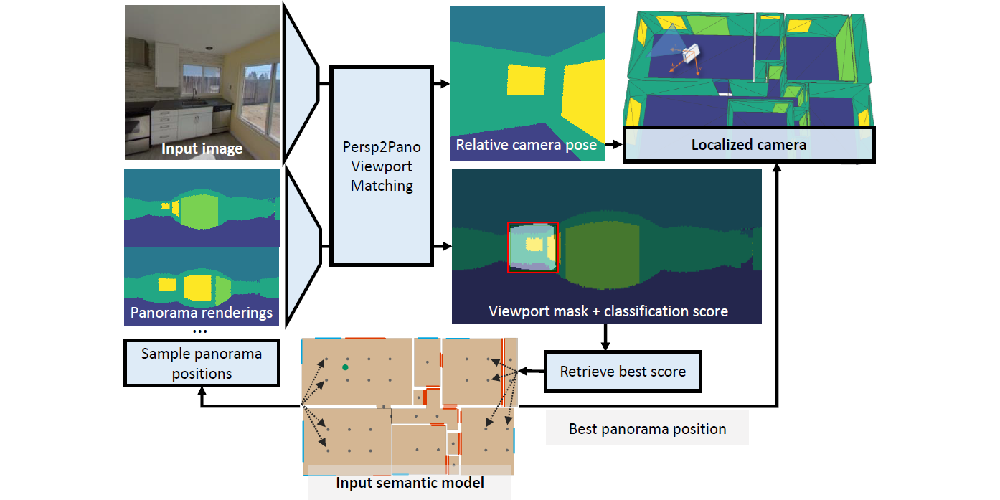

# SPVLoc: Semantic Panoramic Viewport Matching for 6D Camera Localization in Unseen Environments

**Niklas Gard, Anna Hilsmann and Peter Eisert**

Project Page (coming soon) | Paper (coming soon) | Presentation (coming soon)

Our method calculates the indoor 6D camera pose by determining the image position and orientation relative to synthetic panoramas. The best panoramic match is found through semantic viewport matching.

# Overview

This is the code repository for the Paper: *SPVLoc: Semantic Panoramic Viewport Matching for 6D Camera Localization in Unseen Environments*.
