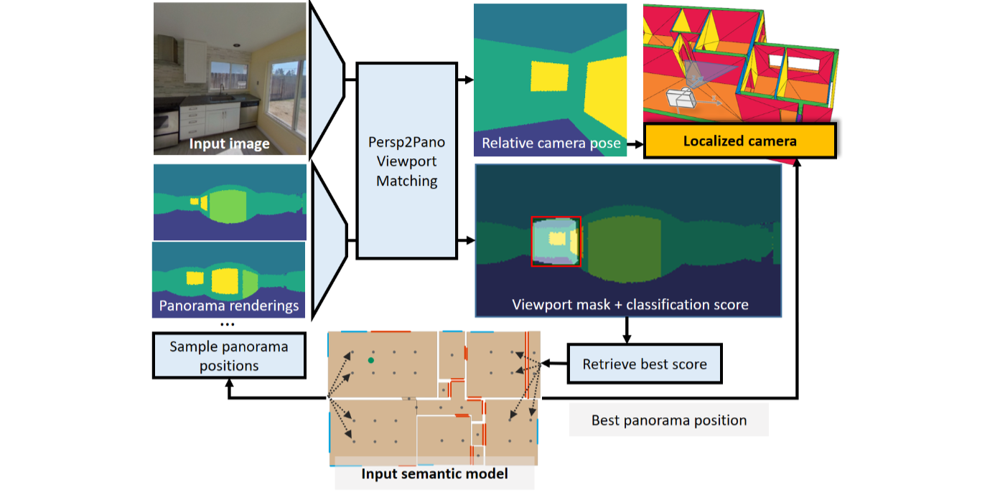
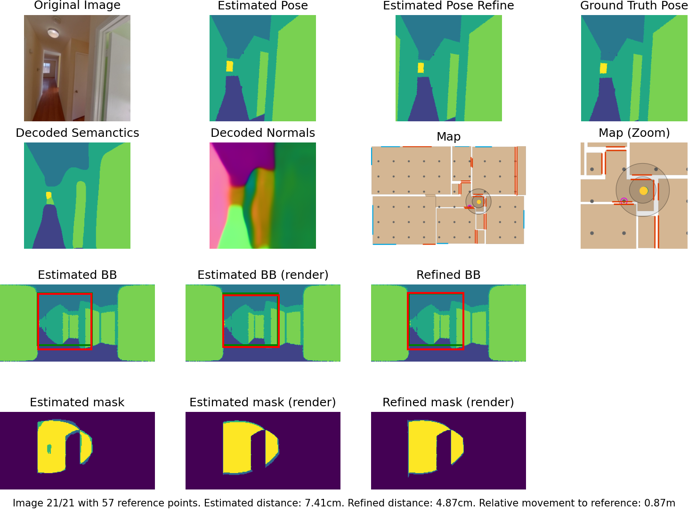

<div align="center">

<h1>SPVLoc: Semantic Panoramic Viewport Matching for 6D Camera Localization in Unseen Environments</h1>

<div>
    ECCV 2024
</div>

<div>
    <a href='https://iphome.hhi.de/gard/index.htm' target='_blank'>Niklas Gard<sup>1,2</sup></a>&emsp;
    <a href='https://iphome.hhi.de/hilsmann/index.htm' target='_blank'>Anna Hilsmann<sup>1</sup></a>&emsp;
    <a href='https://iphome.hhi.de/eisert/index.htm' target='_blank'>Peter Eisert<sup>1,2</sup></a>&emsp;
</div>
<div>
    Fraunhofer Heinrich Hertz Institute, HHI<sup>1</sup>, Humboldt University of Berlin<sup>2</sup>
</div>

## [Project Page](https://fraunhoferhhi.github.io/spvloc/) &nbsp;|&nbsp; [Paper (arXiv)](https://arxiv.org/abs/2404.10527)

<div>

</div>


<!---->
</div>



Our method calculates the indoor 6D camera pose by determining the image position and orientation relative to synthetic panoramas. The best panoramic match is found through semantic viewport matching.

## 📋 Overview

This is the code repository for the Paper: *SPVLoc: Semantic Panoramic Viewport Matching for 6D Camera Localization in Unseen Environments*.

This repository provides:

- Code for training and testing SPVLoc on [ZinD](https://github.com/zillow/zind)  and [Structured3D](https://github.com/bertjiazheng/Structured3D) dataset.
- Checkpoints to test SPVLoc on our compiled testsets with variable FoV network, and a checkpoint to test SPVLoc on perspective images coming with S3D.
- Scripts to convert ZinD to the [Structured3D format](https://github.com/bertjiazheng/Structured3D/blob/master/data_organization.md) enabling its use for training 6D pose estimation methods.
- Scripts to reproduce our test sets (variable FoV, variable pitch/roll offsets) for both datasets.
- Visualization of results.

## 📢 Updates

29.04.2025: Added [quick interactive demo](#-quick-demo) using a ZinD sample scene. 🚀\
01.10.2024: SPVLoc was presented at **ECCV 2024** with an **oral and poster presentation**. ✨ \
22.07.2024: **Added source code.** Please don't hesitate to report compatibility problems or other issues. There might be updates in the next weeks. 🎉🎈🥳 \
15.07.2024: Added [project page](https://fraunhoferhhi.github.io/spvloc/). \
05.07.2024: We are happy to announce that SPVLoc has been accepted to **ECCV 2024**. The source code is undergoing last preparations and will be added here very soon.

## 🔧 Installation

### Step 1: Setup Conda environment

```bash
# Create conda environment from environment.yaml file
conda env create -f environment.yaml
# Activate the environment
conda activate spvloc
```

### Step 2: Install additional dependencies

```bash
# Build and install redner
./data/setup/install_redner.sh
# Install patched version of pyrender
./data/setup/install_pyrender.sh
```

Execute the following script if you want to run the code on a Linux server without a monitor.

```bash
./data/setup/prepare_mesa.sh
```

### Step 3: Download the pretrained models

```bash
python -m spvloc.tools.download_pretrained_models
```

## 🚀 Quick Demo

This demo downloads a test scene from the [Zind repository](https://github.com/zillow/zind/tree/main).

### 1. Prepare the Demo

Run this command to download the data and model:

```bash
python -m spvloc.tools.prepare_demo
```

### 2. Run the Demo

Execute the interactive visualization:

```bash
python -m spvloc.tools.visualize_matching -c configs/config_demo.yaml -t data/pretrained_models/ckpt_zind_demo_large_angle.ckpt
```

## Dataset Preparation (ZiND)

### Step 1: Download the ZiND dataset

1. Follow the procedure described [here](https://github.com/zillow/zind?tab=readme-ov-file#registration-for-download-request) to get access to the dataset.
2. [Download](https://github.com/zillow/zind?tab=readme-ov-file#batch-download) the dataset to `/path/to/original/zind_dataset`

### Step 2: Convert the dataset to S3D format

Use the following command to convert the dataset to the S3D format:

```bash
python -m spvloc.tools.zind_to_s3d \
    -i /path/to/original/zind_dataset \
    -o /path/to/zind_dataset
```

- To export 3D scene meshes for preview (`-m`). Note that this slows down the conversion.
- For a specific scene index `xy` (0-1574), use `-idx xy`.

### Step 3: Generate the testsets

```bash
python -m spvloc.tools.dataset_from_csv \
    -d data/datasets/zind/dataset_info.csv \
    -i /path/to/zind_dataset \
    -o /path/to/zind_testset
```

## Dataset Preparation (S3D)

### Step 1: Download the S3D dataset

1. Follow the procedure described [here](https://structured3d-dataset.org/) to access the dataset.
2. Download at least the panoramic panorama images (`Structured3D_panorama_00.zip - Structured3D_panorama_17.zip`) and the annotations (`Structured3D_annotation_3d.zip`). Also download the perspective images to train/test with the those images as done in our supplementary material.
3. Extract the dataset to `/path/to/s3d_dataset`.

### Step 2: Generate the testsets

```bash
python -m spvloc.tools.dataset_from_csv \
    -d data/datasets/s3d/dataset_info.csv \
    -i /path/to/s3d_dataset \
    -o /path/to/s3d_testset
```

## Testing

### Test SPVLoc on ZiND

```bash
python ./spvloc_train_test.py -c configs/config_eval_zillow.yaml \
    -t data/pretrained_models/ckpt_zind.ckpt \
    DATASET.PATH /path/to/zind_testset \
    TEST.PLOT_OUTPUT False \
    TEST.SAVE_PLOT_OUTPUT False \
    TEST.SAVE_PLOT_DETAILS False \
    POSE_REFINE.MAX_ITERS 0 \
    SYSTEM.NUM_WORKERS 0
```

Set `POSE_REFINE.MAX_ITERS 1` to activate pose refinement. \
Set `SYSTEM.NUM_WORKERS` to a higher value to use CPU parallelization in the dataloader.

Use `DATASET.TEST_SET_FURNITURE` argument to select different testsets, e.g. `full_90_10_10` for 90 degree field of view and plus/minus 10 degree roll pitch variation. \
The checkpoint is trained to handle angle variation in a range of plus/minus 10 degree. We will make a model trained with larger angle variation available soon.

### Test SPVLoc on S3D

Use `-c configs/config_eval_s3d.yaml`, `DATASET.PATH /path/to/s3d_testset` and `-t data/pretrained_models/ckpt_s3d.ckpt` to test the model with S3D.

### Test SPVLoc on perspective images from S3D

Use `-c configs/config_eval_s3d_perspective.yaml`, `DATASET.PATH /path/to/s3d_dataset` and `-t data/pretrained_models/ckpt_s3d_16_9.ckpt` to test the model with S3D perspective images. Use `DATASET.TEST_SET_FURNITURE` to select `full` or `empty` images.

### Visualize results on ZiNd or S3D

The testing script can be used to generate visualizations of the results. An overview image (see below) will be plotted or saved for the test images. \
In the top row, the 3D model is rendered with the estimated camera pose and can be compared to the model rendered with ground truth pose.

Set `TEST.PLOT_OUTPUT True` to plot overviews images image by image. \
Set `TEST.SAVE_PLOT_OUTPUT True` to plot save overview images for all test images. \
Set `TEST.SAVE_PLOT_DETAILS True` to save the parts of the overview image as separate images.



## Training

### Train SPVLoc on ZInD

```bash
python ./spvloc_train_test.py -c configs/config_zillow.yaml \
    DATASET.PATH /path/to/zind_dataset \
    TRAIN.BATCH_SIZE 10 \
    SYSTEM.NUM_WORKERS 8
```

Set `SYSTEM.BATCH_SIZE` as high as possible with your GPU. We used `TRAIN.BATCH_SIZE 40` with an NVIDIA A100 GPU with 40GB. \
Set `SYSTEM.NUM_WORKERS` to the highest possible value to maximize the benefits of CPU parallelization in the dataloader.

### Train SPVLoc on S3D

Use `-c configs/config_s3d.yaml` and `/path/to/s3d_dataset` to train a model with S3D.\
Add the flag `DATASET.S3D_NO_PERSP_IMAGES True`, in case that you have not downlaoded the full S3D dataset, including all perspective images.

## Acknowledgements

This work is partially funded by the German Federal Ministry of Economic Affairs and Climate Action (BIMKIT, grant no. 01MK21001H) and the German Federal Ministry for Digital and Transport (EConoM,  grant no. 19OI22009C). \
We would like to thank our student assistant, Roberto Perez Martinez, for his help and support during the development of the ZinD to S3D conversion scripts.

## 📚 Citation

If you find this code or our method useful for your academic research, please cite our paper

```bibtex
@inproceedings{gard2024spvloc,
 title        = {SPVLoc: Semantic Panoramic Viewport Matching for 6D Camera Localization in Unseen Environments},
 author       = {Niklas Gard and Anna Hilsmann and Peter Eisert},
 year         = 2024,
 booktitle    = {Computer Vision -- {ECCV} 2024: 18th European Conference on Computer Vision, Proceedings, Part LXXIII},
 publisher    = {Springer Nature Switzerland},
 address      = {Cham},
 pages        = {398--415},
 doi          = {10.1007/978-3-031-73464-9_24},
 url          = {https://fraunhoferhhi.github.io/spvloc/}
}

```
